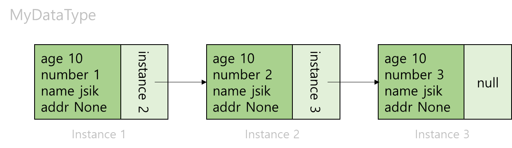

#Day1

## 1. 연결리스트 (Linked List)
***
###왜 써야하나요? 
링크드 리스트의 개념을 이해하기 위해서는 노드라는 개념을 먼저 이해해야한다.


###노드란?
자료의 하나의 단위를 표현할 때 노드라고 정의한다. 
예를들어, 당신이 사람을 정의하고 관리하기 위해서 아래와 같은 데이터 타입을 만들었다고 가정해보자. 

### 그럼 이제 연결 리스트를 알려줘 

```java
public class MyDataType{
    int age;
    int number;
    String name;
    String addr;
}

```
우리는 이 클래스를 자료형처럼 사용할 것이다. 이 클래스를 배열로 사용하려면 아래와 같이 사용한다.

```java
public class Manage{

  public static void main(String[] args) {
    MyDataType[] people = new MyDataType[100];
  }
    
}

```
위와 같이 생성을 하려면 배열의 갯수를 확정할 수 밖에 없다. 만약, 데이터가 <u>**월등히 적거나**</u>,
<u>**100개 이상으로 많다면**</u>, 동적으로 공간을 늘릴 수가 없다. 배열 생성의 특성상 사이즈를 지정해야하므로,
가변적인 상황에서 대응하기가 어려운 구조다. 이러한 문제를 해결하기 위해 다음과 같은 방식을 이용한다.

```java
public class MyDataType{
    public MyDataType next_node; 
    int age;
    int number;
    String name;
    String addr;
    
    ///생성자 생략
       
}

```
C++에서는 "자가참조포인터를 만든다" 라고 배웠던 기억이난다. 무슨말이냐 하면, 자기 자신과 같은 타입의 객체 변수를 내부에 둔다는 말이다.
(JAVA에서는 포인터의 개념이 없고, 기본형을 제외한 나머지 자료형이 참조형이므로 포인터의 개념은 생각하지 않아도 된다.) 이렇게 만들어 졌을 때, MyDataType의 객체 하나 하나를 노드라고 표현한다.

### 연결리스트 정의
각 노드간의 연결을 이용하여 리스트를 구현한다 하여 연결리스트라 한다.


### 아~ 그래서 저렇게 구현하면 뭐가 좋냐고~?  😡😡
각 인스턴스 내부에 자가참조 변수가 있기 때문에 자가 참조변수에 새로운 인스턴스를 연결 시킨다면, 배열 없이도 배열처럼 구현을 할 수 있다.
심지어 동적으로 말이다. 

```java
public class Manage{

  public static void main(String[] args) {
        //노드 생성
        MyDataType instance1 = new MyDataType(10,1,"jik","None");
        MyDataType instance2 = new MyDataType(10,2,"jik","None");
        MyDataType instance3 = new MyDataType(10,3,"jik","None");
        //노드 연결
        instance1.next_node = instance2;
        instance2.next_node = instance3;
        //↑ 위 노드들은  "1 -> 2 -> 3-> null"로 구성된 연결리스트라 할 수 있다.
  }
    
}
```
그림으로 표현하면 아래와 같다.



연결리스트는 배열이 가지는 단점 중 하나인 고정크기 문제를 해결하는 자료구조이다. 
크기를 할당할 필요없이 그때 그때 필요에 따라 늘려갈 수 있으므로 배열 보다 더 효율적으로 사용할 수 있다.


또한 삽입과 삭제 부분에서 유리하다. 배열의 경우, 원소 중간에 데이터를 끼어넣으려면, 고정된 크기를 넘지 않는지 확인하고, 데이터를 추가 한 뒤, 모든 데이터를 미뤄야하하지만, 연결리스트는 그럴 필요가없다. 
그냥 넣고 싶은 위치의 자가 참조 변수들만 바꿔주면 추가가 일어난다.


###단점은 없어 그럼 ?🤔
1. 검색이 효율이 홀리몰리하게 쓰레기다.
   + 이유는 간단하다. 배열처럼 인덱스가 없다. 오로지 자가참조변수만 있을 뿐이다.
   + 따라서 마지막 노드를 검색하려면, 모든 노드를 거쳐 마지막까지 가야한다.😱😱😱

###연결리스트의 종류

 단점을 보완한 종류의 연결리스트도 존재한다.
1. 단일 연결리스트 (Singly Linked List)
2. 이중 연결리스트 (Doubly Linked List)
3. 다중 연결리스트 (Multiply Linked List)
4. 원형 연결리스트 (Circular Linked List)


### 주요 메서드
```java
    isEmpty();                  //비었는지 확인
    add(<T> item);              //추가
    get(int index);             //데이터 값만 가져오기
    remove(int index);          //삭제
    size();                     //크기 반환

```


## 2. 스택(Stack)
***

### 정의
* 스택은 더미를 쌓다라는 Stack이라는 어원에서 따온 개념이다. 들어가는 입구와 나가는 출구가 같은 방향인 구조를 지니고 있다.
때문에 제일 나중에 쌓인 것이 제일 먼저 나오는 후입선출(Last In First Out) 구조를 가지고 있다.


###왜써요 이거 ?
~~입구를 두개만들기 귀찮아서 한개만 쓰려고!!~~

* 스택의 목적은 후입선출 구조에 있다. 제일 직전에 한일을 먼저 불러온다는 것을 활용하는 것이다.
대표적인 예로 undo(Ctrl+Z)가 있다. 만약 스택 구조가 없다면, Ctrl+Z기능을 구현할 수 없다.😭😭 실로 절망적인 일이 아니겠는가 ?


* 스택은 히스토리 역추적에 자주 쓰인다. Exception에러가 발생했을 때를 기억해보자. 
틀린 라인부터 해당 라인을 호출하는 모든 메서드와 클래스를 호출한다. 


* 함수의 동작방식 또한 스택의 구조를 이루고 있다. 재귀 호출이 대표적인 스택구조의 예이다.


* 해당 구조로 이루어진 알고리즘은 DFS가 대표적일 것이다.


###장점은 모야 그럼 ?😍
1. 일단 구조가 단순하다. 쌓아 놓기만하고 위에서 부터 읽기만 하면된다.

2. Stackoverflow의 주범이 바로 이 녀석이다. Stack구조를 잘못구현한다면, 무한루프로 이녀석을 만나게 된다.😡 

3. 데이터 저장/읽기 속도가 빠르다. 

###단점은 없어 그럼 ?🤔
1. 가장 위의 원소만 접근이 가능하다.
2. LIFO 구조에 어긋나는 행동에서 불편함을 유발한다. 
   + ex) stack 구조에서 중간에있는 값만 뺀다거나... (이러면 안된다.)

### 주요 메서드 

```java

    isEmpty();                  //큐가 비었는지 확인
    push(<t> items);            //아이템 삽입
    pop();                      //아이템 삭제
    peek();                     //top 아이템 반환
    search(Object o);           //해당 아이템의 index 반환
    size();                     //해당 스택의 아이템 갯수를 반환

```

## 3.큐 (Queue)
***
### 정의
* 스택과 마찬가지로 queue 어원에서 따왔다. 큐 자체가 '차례로 기다리는 줄' 같은 개념이다. 
줄서서 놀이기구에 입장하듯, 먼저 들어온것이 먼저 나가는 선입선출(FirsInFirstOut) 구조를 가지고있다.

+ p.s) 본인은 처음 배울 때 스택과 큐를 상반대는 구조로 생각하며 외웠다. 

###왜써요 이거 ?
* 입력된 데이터를 순차처리 해야 할 때 쓴다.
    + ex) 키보드 입력이 스택구조라면, 문장하나를 치기 위해서 미친듯한 역순 배치 능력이 필요하게 될 것이다.

* 해당 구조로 이루어진 알고리즘은 BFS가 대표적인 예이다.

* 프로세스 스케줄링 방식에 쓰인다.


###장점은 모야 그럼 ?😍
1. 선입선출 그거 말고는 😅😅😅😅


###단점은 없어 그럼 ?🤔
1. 큐구조를 무엇으로 만드냐에 따라 다르겠지만,
   + 배열로 이루어진 큐라면, 꺼낼 때마다 하나씩 자료를 앞으로 밀어야하고, 크기가 제한되어 오버플로우 발생 위험도 있다.


### 주요 메서드

```java

    isEmpty();                  //큐가 비었는지 확인
    add(<t> items);             //아이템 삽입
    poll();                     //아이템 삭제 ( 출구 에서 삭제)
    peek();                     //top 아이템 반환
    search(Object o);           //해당 아이템의 index 반환
    size();                     //해당 스택의 아이템 갯수를 반환
```

## 4. Deque
***

### 정의
얘는 큐의 혼종이라 보면된다. Double-End-Queue 를 줄여서 덱(Deq)이라고 부른다. 이름에서 보여지듯 출구가 두 개인 큐다.
그럼 입구는 몇개냐고 ? 입구도 두 개다.

큐에 입구에서도 삽입과 삭제가 가능하고, 큐에 출구에서도 삽입과 삭제가 가능하다.
(하지만 실제로 그렇게 다 쓰는 경우는 없다.)

###왜써요 이거 ?
* 왜 양쪽끝에서 처리가능한 혼종을 만들었는지 생각해보면 그 답을 이해하기가 쉽다.
    * 예를들어 입구쪽에서 삽입 삭제를 진행하며, 출구에서 삽입 한다면 스택 혼종일 것이고,👹👹
    * 한쪽에서 순차적으로 삽입하고 입구와 출구에서 삭제한다면 큐 혼종일 것이다.🤖🤖
  

* 스택이나 큐의 특징을 어느정도 지니면서, 특정 조건을 만족시키기 위해 쓴다.


* 선입선출을 기준으로 하나, 우선순위를 두어 먼저 뽑아야할 것이 있을 때

그외 사용
* 스케줄링


###덱의 사용 조건🔑

* 모든원소에 대해 O(1)의 시간 복잡도
* 양쪽 출입구에서 일어나는 삽입/삭제에 대해 O(1)의 시간 복잡도

###얜 장단점 왜 안해 ?🤔

* 글쎄... 순혈이아닌 혼종이란게 단점아닐까 ?😄😄

```java
        //First 출구 Last 입구
        isEmpty();                  //큐가 비었는지 확인
        add(<t> items);             //Rear 쪽으로삽입
        addFirst(<t> items);        //Front 쪽으로 삽입
        pollFisrt();                //Rear에서 아이템을 뺀 후 값 반환
        pollLast();                 //Front에서 아이템을 뺀 후 값 리턴
        peekFisrt();                //Front 아이템 반환
        peekLast();                 //Rear 아이템 반환
        search(Object o);           //해당 아이템의 index 반환
        size();                     //해당 스택의 아이템 갯수를 반환
```
 

## 문제 선택
***
스택 계열 문제 silver 3 : https://www.acmicpc.net/problem/15815
덱 계열 문제 silver 1 : https://www.acmicpc.net/problem/20923


##Reference📑
***

* ###내용 참조
  * https://myblog.opendocs.co.kr/archives/1347
  * https://velog.io/@riceintheramen/Linked-list
* ###heejeong kwon 님의 Stack Queue 구현
  + stack : https://gmlwjd9405.github.io/2018/08/03/data-structure-stack.html
  + queue : https://gmlwjd9405.github.io/2018/08/02/data-structure-queue.html