#Day2
***
Study date : 2021.10.01

참여자 : J-sik 외 1명

#비선형 자료구조 - 1
***

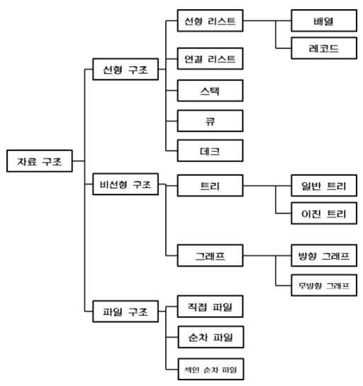

오늘 알아볼 자료구조는 비선형 자료구조(Non-Linear Datastructures)다.
이전 시간의 배운 선형 구조들에 대해 생각해보자. 자료들의 전후관계를 보자면, 확실하게 전후를 알 수있는 녀석들이다.

자신의 앞 뒤 노드가 정확하게 누군지 알고 있기 때문에 일직선의 '선형'으로 표현될 수 있다. 그러한 구조는 선형구조가 갖는 1:1의 관계성 때문이다.

반면, 비선형구조들은 1:N의 관계성을 가지고 있다. 즉, 하나의 노드가 여러 노드를 가질 수 있기에 일직선으로 표현이 불가능한 구조들이다.

오늘은 이러한 비선형 구조들 중 트리에 해당 되는 자료구조에 대해 스터디해보겠다. 총 5가지 자료구조를 준비했다. 

들어가기 앞서, 트리의 공통적인 특징을 먼저 짚고 넘어가자.

##트리의 특징
***

1. 그래프의 한 종류로 방향성을 지닌다.
    * 트리도 그래프의 일부이다. 그러나 방향성이 있는 그래프이므로, 그래프보다 더 작은 부분이다.
2. Self-loop가 불가능하다.
    * 자기 자신으로 가는 간선이 존재하지않는다.
    * 사이클이 존재하지 않는 비순환 그래프이다.
3. 루트의 개념이 존재하며, 자식노드는 단 하나의 부모만을 가진다.
4. 계층모델을 가지며, 순회의 개념을 가진다. (Pre-Order , In-Order,Post-Order)
5. 노드가 N일 때, 간선의 갯수는 N-1이다.

*c.f )* 알아두면 도움될 용어정리

* Node(Vertex) : 트리에서 정보를 담고 있는 하나의 객체를 의미.
* Edge(Link) : 노드를 잇는 간선을 의미.
* Depth : 루트 노드부터 말단노드 까지의 깊이를 의미.
* level : 같은 깊이를 갖는 노드를 의미.
* 차수 : 해당 노드가 가지는 자식의 간선 수.
* 리프노드 : 자식이 없는 말단 노드를 의미.

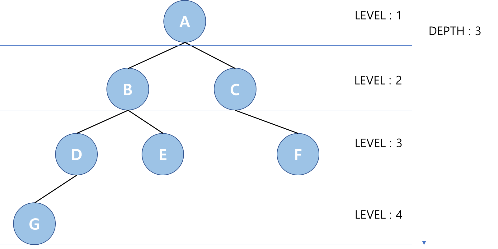

## 1. 이진트리
***

###정의
* 자식노드가 최대 2개인 노드로 구성된 모든 트리를 말한다.
* 이진 탐색 트리, 균형 트리 등을 포함하는 가장 포괄적인 범위의 트리

## 2. 이진 트리 (이진 탐색 트리)
***

###정의
* 이진 탐색의 효율적인 탐색 능력 + 연결리스트의 조합
    * 이진탐색 : 탐색만이 주 목적으로  ***O(logN)*** 의 시간복잡도를 가진다.
    * 연결리스트 : 삽입,삭제에 뛰어난 효율로 ***O(1)*** 의 시간복잡도를 가진다.
    * ※ 두개를 조합하여, 탐색의 우수한 속도를 가지고도, 삽입과 삭제를 가능하게 고안한 트리
* 이진 탐색의 특성을 이용하여, 노드를 기준으로 왼쪽 하위에는 작은 키값의 노드, 오른쪽 하위에는 큰 키값의 노드로 구성한다.
* 중회 순회(In-Order)를 통해 모든 값을 정렬된 순서로 읽을 수 있다. 
* 트리의 균형이 잡힌경우 ***O(logN)*** , 최악의 경우 ***O(N)*** 의 시간복잡도를 가진다.

### *탐색과 삭입 삭제를 둘다 잡겠다더니... O(N)이면 뭐하자는 거임!*
충분히 그렇게 생각할 수 있다. 이진 탐색트리는 컨셉이 탐색이다. 따라서 루트노드의 키값에 따라 한쪽으로 치우친 트리가 나올 수도 있다.
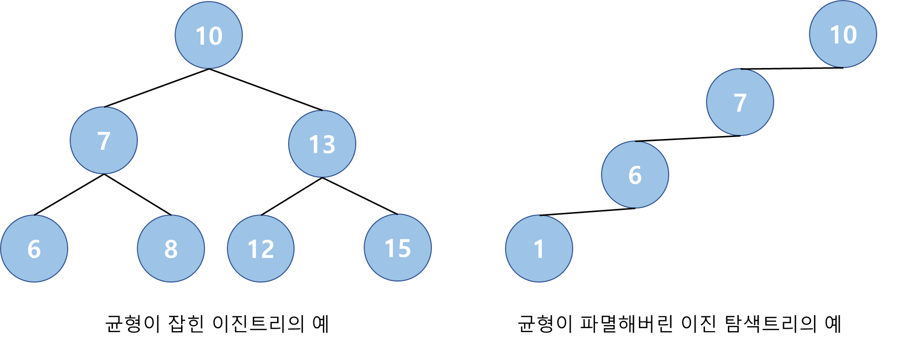

###검색
1. Target Key 값이 루트보다 큰지 작은지 확인
2. 작다면 왼쪽 하위트리에서 재검색, 크다면 오른쪽 하위트리에서 재검색
3. 값을 찾을때까지 반복한다. 단, 리프노드에서 발견하지 못했을 경우, null 반환

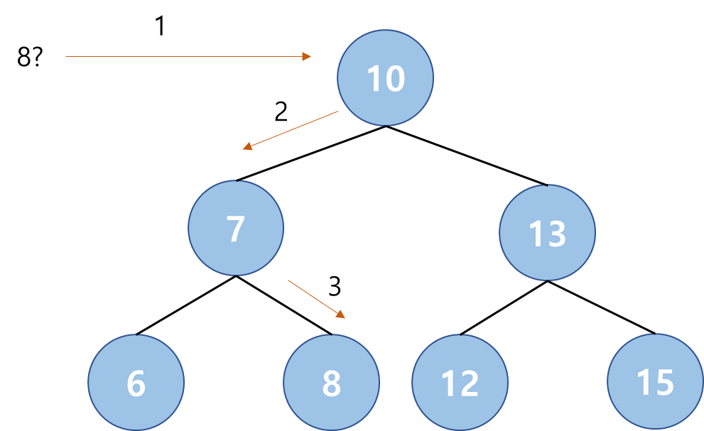

###삽입
1. Targket key 값이 루트보다 큰지 작은지 확인
2. 작다면 왼쪽 하위트리에서 재귀, 크다면 오른쪽 하위 트리에서 재귀
3. 리프노드 까지 반복한다.
4. 리프노드보다 값이 작다면 왼쪽 하위에 생성, 크다면 오른쪽 하위에 생성

   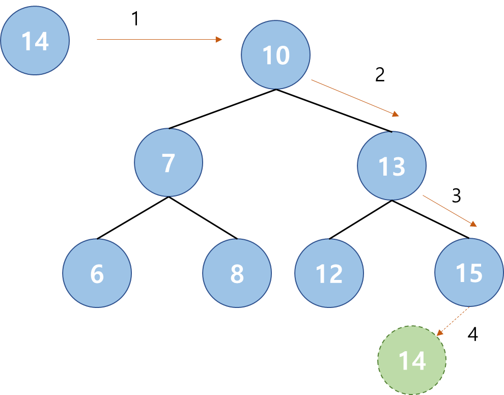
###삭제
삭제는 조금 까다롭다. 리프노드인지, 부모노드라면, 리프노드의 갯수에따라 나누어 삭제해야한다.
1. 삭제노드가 리프노드인 Case
   1. 해당 노드를 지운다.
   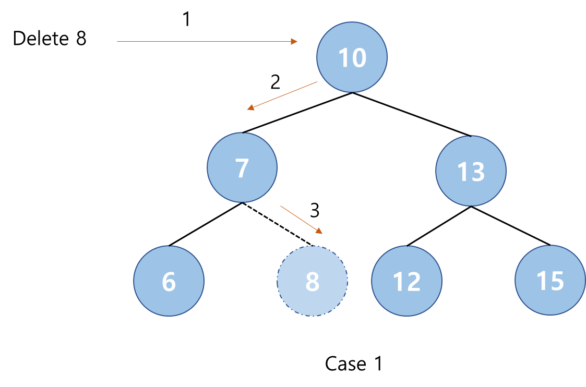
2. 삭제노드가 하나의 자식 노드를 갖고 있는 Case
    1. 삭제 노드의 부모노드를 삭제 노드의 자식 노드로 연결한다.
    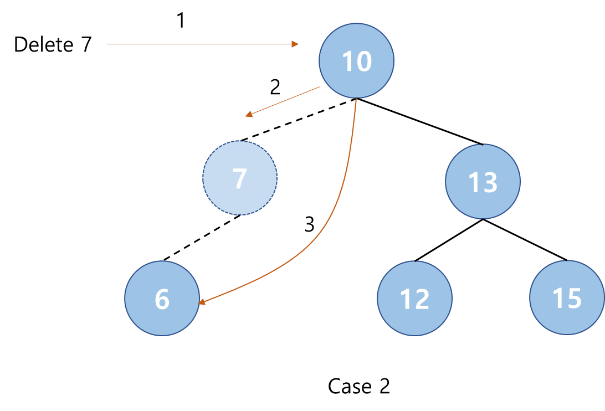
3. 삭제노드가 두개의 자식 노드를 갖고 있는 Case
    1. In-Order를 통해 삭제 노드의 대체자를 찾는다.
    2. 대체 노드의 키값을 삭제노드로 옮기고, 대체노드를 삭제한다.
    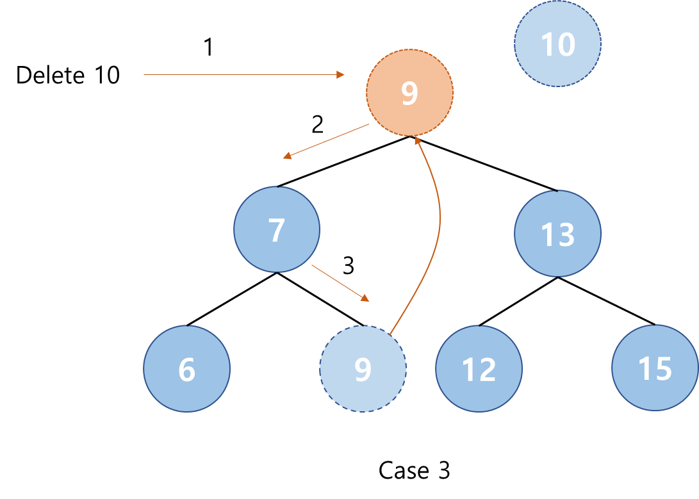

## 3. 이진 트리 (AVL 트리)
***
앞서 보았듯이, 균형잡힌 트리에서는 ***O(logN)*** 을 보장하지만, 블균형트리에서는 최악의 경우 ***O(N)*** 이므로, 그것을 개선시키기 위한 트리이다.

###정의
* 각 노드의 양쪽 서브트리의 높이 차가 1이하인 이진 탐색트리이다.
* 트리가 불균형 상태가 되면, 균형 상태로 노드를 재배치한다.
* 따라서 이진트리의 문제점인 최악의 상황을 보완하고 ***O(logN)*** 시간을 보장한다.

### 어떤 경우에 균형이 깨질까 ?
* 데이터 삽입과 삭제에 따라 균형이 깨질 수 있다. 따라서 삽입/삭제 연산 이후 양쪽 서브트리의 높이차를 재귀적으로 확인하고,
만약 높이차가 2이상 난다면, 재배치를 수행한다.

* 재배치를 수행하는 4가지 경우
    * case1. **LL** - 새 노드가 부모노드의 왼족 서브트리의 왼쪽 서브트리에 생성되는 경우
    * case2. **RR** - 새 노드가 부모노드의 오른쪽 서브트리의 오른쪽 서브트리에 생성되는 경우
    * case3. **LR** - 새 노드가 부모노드의 왼쪽 서브트리의 오른쪽 서브트리에 생성되는 경우
    * case4. **RL** - 새 노드가 부모노드의 오른쪽 서브트리의 오른쪽 서브트리에 생성되는 경우

* case1 재배열
  * 오른쪽으로 회전
  
    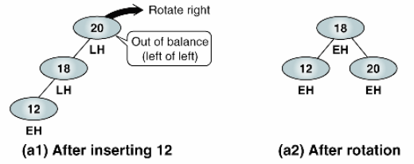

* case2 재배열
  * 왼쪽으로 회전
  
    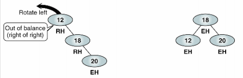

* case3 재배열
  * 부모노드의 왼쪽 서브트리 부터 왼쪽으로 회전 후, 부모 노드를 오른쪽으로 회전
  * 즉, 리프노드를 부모노드로 회전하는 과정

    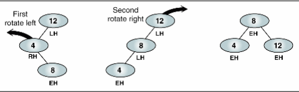

* case4 재배열
  * 부모노드의 오른쪽 서브트리 부터 오른쪽으로 회전 후, 부모 노드를 왼쪽으로 회전
  * 즉, 리프노드를 부모노드로 회전하는 과정
  * (LR case의 정반대라 Reference 사이트에 사진 없음)
  
## 4. 이진 트리 (레드 블랙 트리)
***

이 또한 균형트리의 일종이다.마찬가지로 삽입,삭제, 검색에서 일정한 실행시간을 보장한다.
기하학 계산구조에 많이 쓰이는 자료구조라고한다.(위키피디아)

###특징
* 함수형 프로그래밍에서 유용하다.
* 연관배열, 집합 등에 내부적으로 많이 쓰임
* AVL 보다 덜 깐깐하다.
  * 높이 차가 2이상이면 재배열하기 때문에, 더 많은 회전이 필요함
* 재배치가 AVL보다 간단하다.

### 레드 블랙 트리의 규칙
이진 탐색트리의 특성을 상속받으며, 아래와 같은 규칙으로 구성되었다.
1. 노드는 레드 혹은 블랙 중의 하나이다.
2. 루트 노드는 블랙이다.
3. 모든 리프 노드들(External Node)은 블랙이다.
4. 레드 노드의 자식노드 양쪽은 언제나 모두 블랙이다. (즉, 레드 노드는 연달아 나타날 수 없으며, 블랙 노드만이 레드 노드의 부모 노드가 될 수 있다)
5. 어떤 노드로부터 시작되어 그에 속한 하위 리프 노드에 도달하는 모든 경로에는 리프 노드를 제외하면 모두 같은 개수의 블랙 노드가 있다.

### 레드 블랙 트리는 어떤 방식으로 균형을 유지하는가?
AVL 트리의 경우 4가지 재배치 방법을 통해 균형을 유지했다. 레드블랙트리의 경우 규칙을 만족하기 위해서, 회전과 색상 전환을 이용한다.
레드 블랙 트리 또한 삽입과 삭제과정에서 재배치가 일어나게 된다.

* 삽입

* 삭제 

실행기 참조 + 추가 포스팅 예정 

## 5. B-트리
***
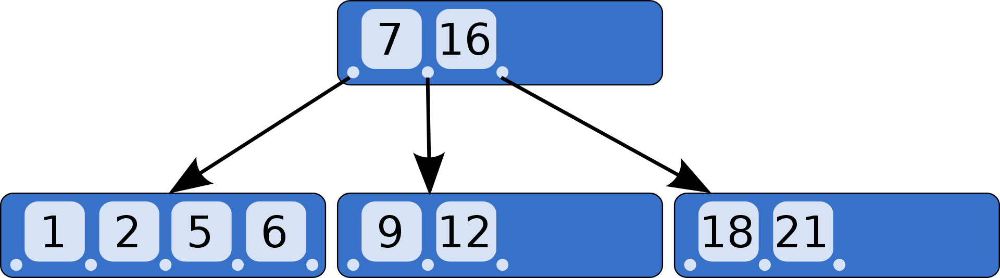
이진트리에서 발전되어, 여러개의 리프노드를 가질 수 있는 트리이다.

###정의 및 장점
* 모든 리프노드들이 같은 레벨을 가질 수 있도록 동적으로 벨런싱된 트리
* 정렬된 순서를 보장
* 멀티레벨 인덱싱을 통한 빠른 검색
* DB에서 자주 쓰이는 구조 (B+ 트리)
* M개의 자식을 가질 수 있는 트리를 M차 B 트리라고한다.

### 규칙 
* 가질 수 있는 키값은 M/2−1 ~ M-1 개 .
* 노드의 키가 x개라면 자식의 수는 x+1개 
* 최소차수는 자식수의 하한값을 의미하며, 최소차수가 t라면 M=2t−1을 만족합니다. 
ex) 최소차수 t가 2라면 3차 B트리이며, key의 하한은 1개)

* 검색
* 삽입
* 삭제

## 6.힙(최대힙, 최소힙)
***
이진트리의 특성을 이용하되, 용도의 맡게 변경된 친구다.

##정의
* 트리 기반 구조로 힙속성을 만족하는 완전 트리, 반정렬상태 이다.
* 최댓값 or 최솟값을 빠르게 찾기 위한 자료 구조

##특징
* 우선순위큐에 특화된 자료구조
* 중복값을 허용한다. 
* 부모와 자식 노드간의 정렬은 키값의 정렬조건에 따라 결정된다.
* 대표적으로 최대힙과 최소힙이 있다. 

##삽입
1. 일단 마지막 노드자리에 삽입한다.
2. 자신의 부모노드와 비교하여 정렬조건에 따라 교환한다.
3. 자기가 바뀌지 않는 정렬조건이 나올때까지 부모 노드와 재귀적으로 시행한다.

##삭제
1. 해당 노드 삭제후, 가장 마지막노드를 그 자리에 삽입한다.
2. 자신의 자식 노드 중 정렬조건에 맞는 노드와 자리를 교환한다.
3. 자기가 바뀌지 않는 정렬조건이 나올때까지 자식 노드와 재귀적으로 시행한다.

## 문제 선택
***
트리 계열 : https://www.acmicpc.net/problem/2078

##Reference📑
***

 * 이진 탐색 트리
   * https://ratsgo.github.io/data%20structure&algorithm/2017/10/22/bst/
   * https://blog.naver.com/dlwoen9/220858725707
   
 * B트리
   * https://velog.io/@emplam27/%EC%9E%90%EB%A3%8C%EA%B5%AC%EC%A1%B0-%EA%B7%B8%EB%A6%BC%EC%9C%BC%EB%A1%9C-%EC%95%8C%EC%95%84%EB%B3%B4%EB%8A%94-B-Tree 
 * AVL
   * https://ko.wikipedia.org/wiki/%EB%A0%88%EB%93%9C-%EB%B8%94%EB%9E%99_%ED%8A%B8%EB%A6%AC
   * https://www.zerocho.com/category/Algorithm/post/583cacb648a7340018ac73f1
 
 * 레드 블랙 트리
   * https://www.cs.usfca.edu/~galles/visualization/RedBlack.html (Best)
   * https://ko.wikipedia.org/wiki/%EB%A0%88%EB%93%9C-%EB%B8%94%EB%9E%99_%ED%8A%B8%EB%A6%AC
 * 힙 
   * https://kayuse88.github.io/binary-heap/
   * https://gmlwjd9405.github.io/2018/05/10/data-structure-heap.html
 * 사진 자료
   * https://server-engineer.tistory.com/130
 * ###heejeong kwon 님의 Stack Queue 구현
     + stack : https://gmlwjd9405.github.io/2018/08/03/data-structure-stack.html
     + queue : https://gmlwjd9405.github.io/2018/08/02/data-structure-queue.html

Date : 2021.10.01